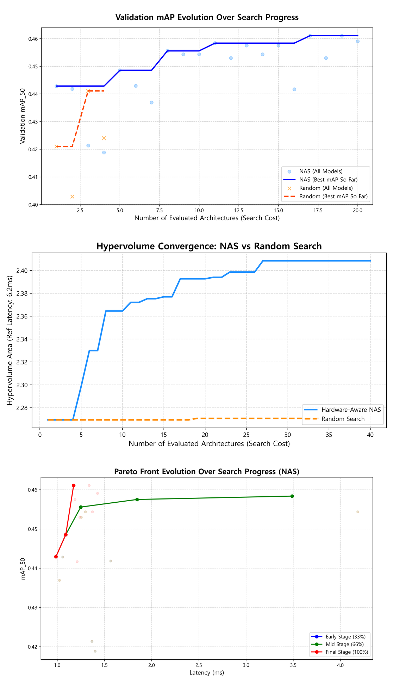
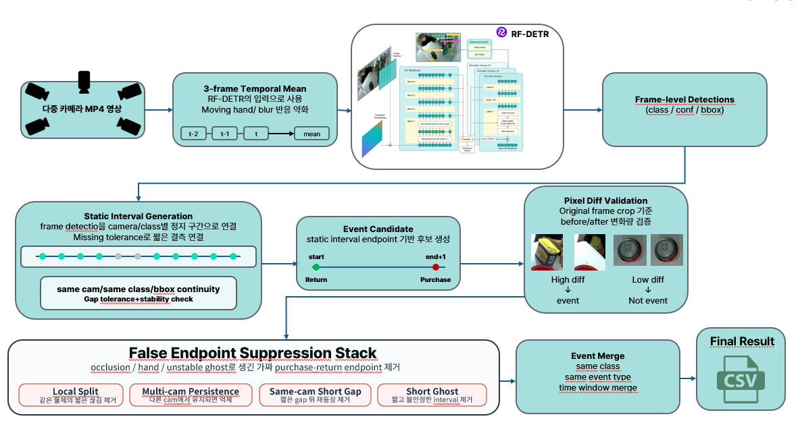
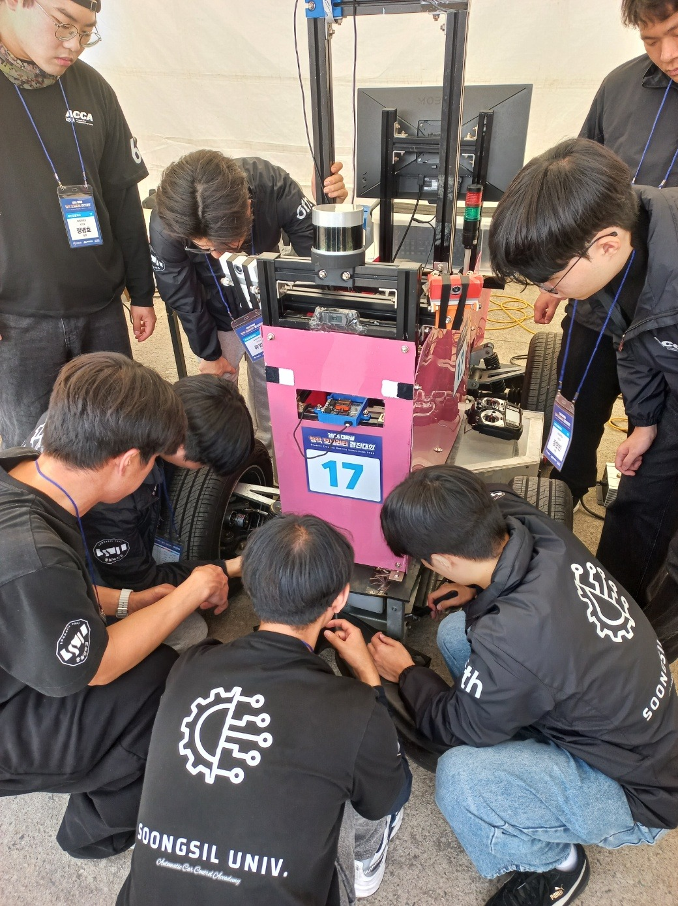
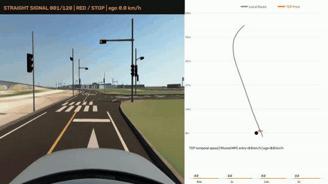
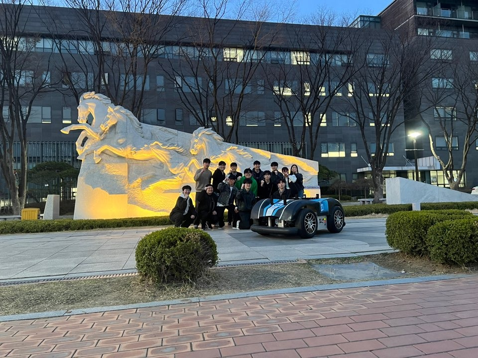

# Kang MyeongJin

**Physical AI · Robot Learning · Multimodal Systems · Robotics**

Mechanical Engineering undergraduate at **Soongsil University** interested in learning-based robotics and Physical AI.

My work spans multimodal perception and sequential learning, real-world robot systems, optimal control, and hardware-aware deep learning. I am particularly interested in connecting **perception, learning, planning, and control** on physical robotic systems.

- President of **ACCA**, Soongsil University robotics/autonomous-systems team
- Experience with real-vehicle robotics, ROS/ROS 2, multimodal learning, perception, and optimal control

---

## Research Interests

- Physical AI & Embodied Intelligence
- Multimodal Robot Learning
- Vision-Language-Action Models
- Robot Learning & Control
- Sim-to-Real and Real-World Robotics
- Efficient & Hardware-Aware AI

---

## Selected Research & Engineering Projects

### [Hardware-Aware Neural Architecture Search](https://github.com/libok03/HW-NAS-YOLO)

**Neural Architecture Search · Multi-Objective Optimization · TensorRT · YOLO**

  

Accuracy–latency Pareto search and convergence comparison against Random Search.

Hardware-aware NAS project for jointly optimizing detector accuracy and inference latency under limited computational resources.

**Project Highlights**
- YOLO11n-based search over network block type, depth, and attention modules
- `3 → 15 → 50 epoch` multi-fidelity evaluation with Successive Halving
- Random Forest-based latency prediction with selective TensorRT FP16 measurement
- NSGA-II-based accuracy–latency Pareto optimization

**My Contribution**
- Conducted model training and experimental evaluation
- Contributed to manuscript writing
- Designed and prepared the project poster

---

### [Multi-Camera Perception & Inventory Estimation](https://github.com/libok03/RF_Detr_Based_Inventory_management)

**RF-DETR · Multi-Camera Perception · Temporal Modeling · Event Estimation**

  

Multi-camera temporal perception pipeline for robust purchase/return event estimation.

Multi-camera system that converts frame-level product detections into temporally stable purchase/return events and inventory updates.

**Project Highlights**
- Five synchronized camera viewpoints
- RF-DETR-based detection for 60 product classes
- Static Interval modeling and endpoint-based event candidates
- Pixel-difference validation and temporal/cross-camera suppression of false events
- Detection performance: **96.76% mAP50–95 · 98.40% Precision · 98.10% Recall**

**My Contribution**
- Developed the temporal event-estimation pipeline
- Contributed to writing and organizing the final project report

---

### [ERP42 Real-Robot Planning, State Machine & MPC Optimization](https://github.com/libok03/ACCA_2025)

**ROS 2 · Path Planning · State Machine · Sensor Integration · MPC**

  

Real-vehicle integration and testing with the ERP42 platform.

Real-world robotics project using the ERP42 platform.

**My Contribution**
- Path planning
- State-machine design
- Sensor integration
- MPC optimization and tuning

---

### [MORAI-Based Robotics System](https://github.com/libok03/ACCA2026)

**MORAI · ROS · Simulation · Multimodal Data · System Integration**

Team repository for the 2026 AI/SW Mobility Competition, used as the simulation and system-integration environment for the multimodal learning project below.

---

## Ongoing Work

### [Multimodal Sequential Learning for Robotic Planning](https://github.com/libok03/VLA_Driving)

**Status: In Progress**

**PyTorch · Multimodal Fusion · Sequential Modeling · ROS · Real-Time Inference**

  

Learning-based planning demo in the MORAI simulation environment.

Learning-based planning system being developed and evaluated in MORAI as a testbed for multimodal robot learning.

**Project Highlights**
- Front/left/right camera, LiDAR BEV, robot state, localization, and route information
- ROS-based synchronized temporal dataset construction
- Learning-based sequential prediction for motion planning
- Approximately **18.4 ms model inference latency** and **20 ms end-to-end processing latency** on the target compute environment

**My Contribution**
- Designed the multimodal learning model
- Collected and labeled training data
- Implemented the training pipeline and inference code
- Integrated the model into the ROS runtime
- Performed and validated real-time inference

> MPC and local-route modules were implemented by other team members.

---

### [LeRobot SO-101 Teleoperation](https://github.com/libok03/maker_fair_2026_teleoperation_lerobot)

**Status: In Progress**

Currently building a LeRobot SO-101 teleoperation setup and exploring robot-learning workflows based on physical demonstration data.

---

## Leadership

### President
**ACCA, Soongsil University · 2026**

- Coordinated robotics and autonomous-system projects
- Managed integration work across perception, localization, planning, control, and learning components
- Organized real-robot and simulation experiments

  

ACCA team, Soongsil University.

---

## Technical Skills

**Languages & ML**  
Python · C++ · PyTorch · TensorRT

**Robotics & Control**  
ROS · ROS 2 · MPC · PID · State Machines · Path Planning

**Perception**  
YOLO · RF-DETR · OpenCV · Camera · LiDAR · IMU · GNSS

**Systems**  
Linux · Git · Docker · CUDA

---

## Other Experiments

[PPO Swing-Up](https://github.com/libok03/PPO_SwingUp) · [Atari DQN](https://github.com/libok03/Atari_DQN_Agent) · [CartPole RL](https://github.com/libok03/CartPole_RL)

---

## Contact

- Email: **markpiano01@gmail.com**
- GitHub: **[@libok03](https://github.com/libok03)**
