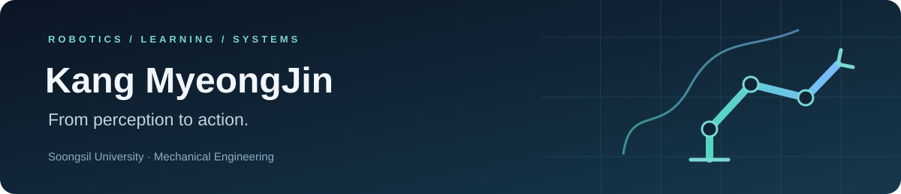

  

  <strong>Robot Learning · Autonomous Systems · Efficient Perception</strong> 
  Mechanical Engineering undergraduate at <strong>Soongsil University</strong> 
  Building learning-based policies and the robotic systems that run them.

  <a href="https://github.com/libok03/VLA_Driving">Autonomous Driving</a> ·
  <a href="https://github.com/libok03/maker_fair_2026_teleoperation_lerobot">Robot Manipulation</a> ·
  <a href="https://github.com/libok03/HW-NAS-YOLO">Hardware-Aware AI</a> ·
  <a href="mailto:markpiano01@gmail.com">Contact</a>

---

## Results at a glance

Measured results from the **TCP-based MORAI driving project**.

| Trajectory prediction | Neural inference | Closed-loop driving |
| :---: | :---: | :---: |
| **0.2924 m ADE** | **11.02 ms mean** | **100% completion** |
| **0.5225 m FDE @ 2 s** | **18.05 ms p95** | **0.38 m mean path error** |
| Held-out open-loop test | Model inference latency | TCP direct · 4 laps in MORAI |

[Evaluation details →](https://github.com/libok03/VLA_Driving#평가-결과)  
These results come from limited MORAI K-City scenarios; open-loop accuracy, model latency, and closed-loop performance are separate measurements.

## Featured projects

### 01 / Learning-based autonomous driving
[**VLA_Driving →**](https://github.com/libok03/VLA_Driving)  
`PyTorch` `TCP` `Imitation Learning` `ROS` `MORAI`

   
  DRIVE / STOP / AVOID predictions · recorded-bag open-loop replay

Adapted **Trajectory-guided Control Prediction (TCP)** to MORAI: front-camera images, vehicle speed, and route conditions produce future waypoints and vehicle control.

- **0.2924 m ADE / 0.5225 m FDE @ 2 s** on the held-out test.
- **100% completion across 4 evaluated laps**, with **0.55 m RMSE** using TCP direct control.
- **11.02 ms mean / 18.05 ms p95** neural inference latency.
- Camera-timestamp dataset alignment, human/teacher data preparation, training, evaluation, and ROS runtime integration.

**My work:** learning-model development, data collection and labeling, training and inference pipelines, and runtime integration. Earlier multimodal planner experiments are also retained in the repository.

System context and contribution boundaries

The broader vehicle system combines localization, route conditioning, and an independent Safety Monitor. The repository primarily provides TCP data conversion, training/evaluation, and earlier planner experiments; it does not contain the complete deployable vehicle stack.

MPC and local-route modules were implemented by other team members.  
[Team system repository →](https://github.com/libok03/ACCA2026)

### 02 / SO-101: planning to physical motion
[**SO-101 Teleoperation & MoveIt 2 →**](https://github.com/libok03/maker_fair_2026_teleoperation_lerobot)  
`ROS 2 Humble` `MoveIt 2` `LeRobot` `Gazebo Harmonic` `ros2_control`

   
  MoveIt 2 plan → physical SO-101 follower → measured joint feedback in RViz

Connecting motion planning to a physical **5-axis arm + gripper**, with feedback from **6 STS3215 servos**.

- Gazebo simulation, URDF/Xacro, MoveIt 2 configuration, and physical follower execution.
- **3 planning pipelines:** OMPL, Pilz, and STOMP.
- Motor setup and calibration tools, trajectory execution, and measured joint-state feedback.
- Ongoing work: teleoperation and demonstration-data workflows; intermittent gripper voltage alarms remain under investigation.

### 03 / Hardware-aware neural architecture search
[**HW-NAS-YOLO →**](https://github.com/libok03/HW-NAS-YOLO)  
`YOLO11n` `NSGA-II` `Ray` `TensorRT FP16`

  
   Accuracy–latency Pareto search and convergence comparison

Searching detector architectures under a joint **accuracy–latency objective**.

- **3 → 15 → 50 epochs:** multi-fidelity evaluation with Successive Halving.
- Block type, depth, and attention-module search with pretrained weight inheritance.
- Random Forest latency prediction with selective TensorRT FP16 hardware measurements.

**My contribution:** model training, experimental evaluation, manuscript writing, and poster preparation.

### 04 / Multi-camera inventory estimation
[**RF-DETR Based Inventory Management →**](https://github.com/libok03/RF_Detr_Based_Inventory_management)  
`RF-DETR` `YOLO` `OpenCV` `Temporal Filtering`

  

**5 camera views · 60 product classes**  
Converting frame-level detections into class counts, temporally filtered observations, and fused inventory estimates.

**My contribution:** temporal event-estimation pipeline development and final report writing/organization. The public implementation includes detection, count extraction, temporal filtering, and class-wise camera fusion.

### 05 / ERP42 real-vehicle robotics
[**ACCA 2025 →**](https://github.com/libok03/ACCA_2025)  
`ROS 2` `Path Planning` `State Machines` `MPC` `Sensor Integration`

  

**My contribution:** path planning, state-machine design, sensor integration, and MPC optimization/tuning on the ERP42 platform.

## Research direction

I am interested in **robot learning and control**, **multimodal perception**, and **efficient models for physical systems**. My current projects connect learned policies with data pipelines, motion planning, and execution. I am also exploring vision-language-action models and sim-to-real robot-learning workflows.

## Toolkit

| Area | Tools & experience |
| :--- | :--- |
| Learning & optimization | Python · PyTorch · TensorRT · CUDA · C++ |
| Robotics & control | ROS / ROS 2 · MoveIt 2 · Gazebo · MPC · PID · State Machines |
| Perception & sensing | RF-DETR · YOLO · OpenCV · Camera · LiDAR · IMU · GNSS |
| Systems | Linux · Git · Docker |

Team activities and other experiments

### ACCA · Soongsil University · President, 2026

Coordinated robotics/autonomous-system projects, integration work across perception, localization, planning, control, and learning, and real-robot/simulation experiments.

  

### Other experiments

[UR5e simulation & pick-and-place](https://github.com/libok03/ros2_SimRealRobotControl) ·
[PPO Swing-Up](https://github.com/libok03/PPO_SwingUp) ·
[Atari DQN](https://github.com/libok03/Atari_DQN_Agent) ·
[CartPole RL](https://github.com/libok03/CartPole_RL)

---

  <strong>Kang MyeongJin · 강명진</strong> 
  <a href="mailto:markpiano01@gmail.com">markpiano01@gmail.com</a> ·
  <a href="https://github.com/libok03">@libok03</a>

