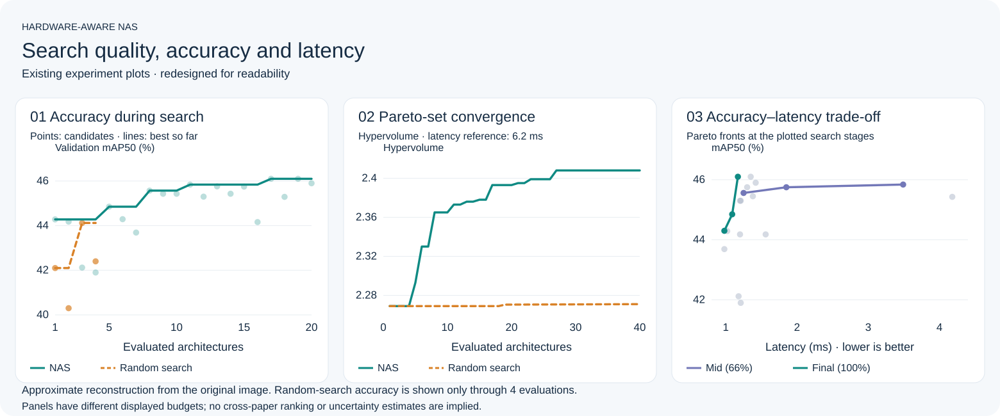
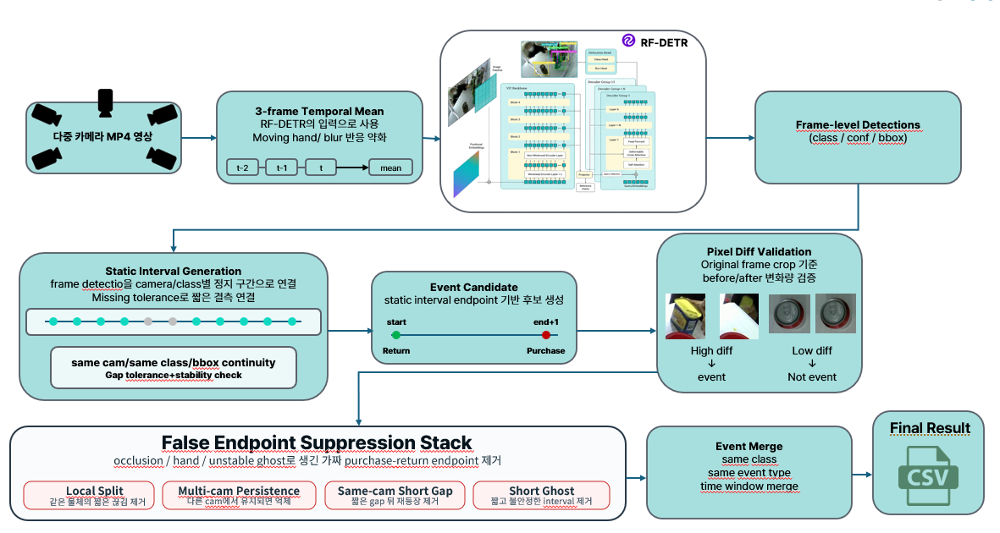
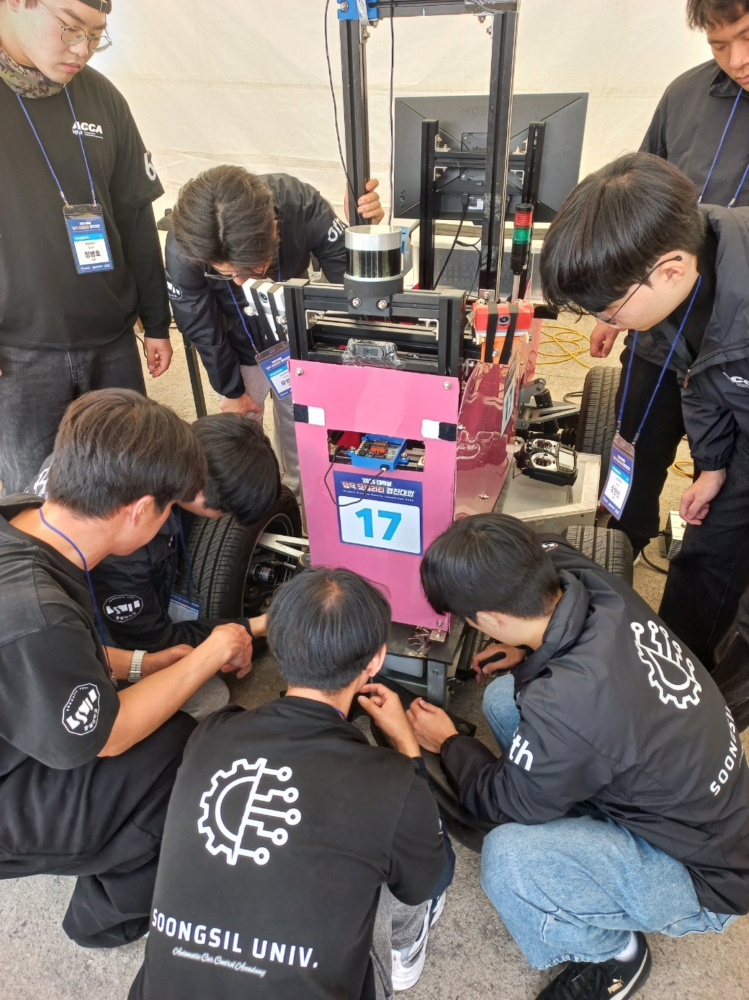
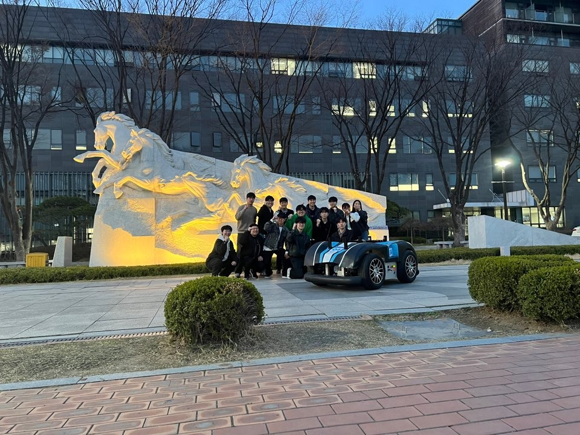

# Kang MyeongJin · 강명진

**Mechanical Engineering undergraduate at Soongsil University**  
**Physical AI · Robot Learning · Multimodal Systems · Robotics**

I work on connecting **perception, learning, planning, and control** in robotic systems. My experience spans learning-based driving in MORAI, hardware-aware model optimization, physical robot-arm integration, multi-camera product perception, and real-vehicle autonomy on ERP42.

In learning-based driving, my work extends from collecting and preparing data to model development, training, evaluation, and ROS runtime integration. My research experience in hardware-aware NAS includes model training, experimental evaluation, manuscript writing, and poster preparation. My current SO-101 work brings motion planning and measured joint feedback together on a physical manipulator. Earlier work on multi-camera inventory estimation and ERP42 autonomy developed my experience in perception, planning, sensor integration, and control.

Alongside technical work, I serve as **President of ACCA**, Soongsil University's robotics/autonomous-systems team, coordinating projects and system integration across perception, localization, planning, control, and learning.

[Email](mailto:markpiano01@gmail.com) · [GitHub](https://github.com/libok03)

## Portfolio overview

| Project | Focus | My work / project scope |
| :--- | :--- | :--- |
| [Learning-based driving](https://github.com/libok03/VLA_Driving) | Policy learning & runtime integration | Model development, data preparation, training, inference, and ROS integration |
| [Hardware-aware NAS](https://github.com/libok03/HW-NAS-YOLO) | Accuracy–latency optimization | Model training, experimental evaluation, manuscript and poster preparation |
| [SO-101 manipulation](https://github.com/libok03/maker_fair_2026_teleoperation_lerobot) | Simulation & physical robot execution | Ongoing project covering calibration, MoveIt 2 integration, and hardware feedback |
| [Multi-camera inventory](https://github.com/libok03/RF_Detr_Based_Inventory_management) | Perception & temporal estimation | Temporal event-estimation pipeline and report preparation |
| [ERP42 autonomy](https://github.com/libok03/ACCA_2025) | Real-vehicle planning & control | Path planning, state-machine design, sensor integration, MPC tuning |

---

## Selected Research & Engineering Projects

### Learning-based autonomous driving
[**VLA_Driving →**](https://github.com/libok03/VLA_Driving)  
`PyTorch` `TCP` `Imitation Learning` `ROS` `MORAI`

| Held-out prediction | Closed-loop evaluation | Neural inference |
| :---: | :---: | :---: |
| **0.2924 m** ADE | **100%** completion · **4 laps** | **11.02 ms** mean |
| **0.5225 m** FDE @ **2 s** | **0.38 m** mean error · **0.55 m** RMSE | **18.05 ms** p95 |

Measured in MORAI K-City; prediction accuracy, closed-loop performance, and model latency are separate evaluations.

   
  DRIVE / STOP / AVOID predictions · recorded-bag open-loop replay

Adapted **Trajectory-guided Control Prediction (TCP)** to MORAI: front-camera images, vehicle speed, and route conditions produce future waypoints and vehicle control.

- **0.2924 m ADE / 0.5225 m FDE @ 2 s** on the held-out test.
- **100% completion across 4 evaluated laps**, with **0.55 m RMSE** using TCP direct control.
- **11.02 ms mean / 18.05 ms p95** neural inference latency.
- Camera-timestamp dataset alignment, human/teacher data preparation, training, evaluation, and ROS runtime integration.

**My contribution:** learning-model development, data collection and labeling, training and inference pipelines, and runtime integration. Earlier multimodal planner experiments are also retained in the repository.

System context and contribution boundaries

The broader vehicle system combines localization, route conditioning, and an independent Safety Monitor. The repository primarily provides TCP data conversion, training/evaluation, and earlier planner experiments; it does not contain the complete deployable vehicle stack.

MPC and local-route modules were implemented by other team members.  
[Team system repository →](https://github.com/libok03/ACCA2026)

---

### Hardware-aware neural architecture search
[**HW-NAS-YOLO →**](https://github.com/libok03/HW-NAS-YOLO)  
`YOLO11n` `NSGA-II` `Ray` `TensorRT FP16`

| Multi-fidelity training | Parallel evaluation | Hardware measurement |
| :---: | :---: | :---: |
| **3 → 15 → 50 epochs** | **8 Ray workers** | **FP16** TensorRT |
| **3 evaluation stages** | Asynchronous candidate evaluation | **20 warm-up + 50 timed runs** |

Implemented search and benchmarking configuration; these numbers describe the method, not measured accuracy improvements.

  

Search accuracy · Pareto-set convergence · Accuracy–latency trade-off. Approximate reconstruction from the archived figure.

Searching detector architectures under a joint **accuracy–latency objective**.

- **3 → 15 → 50 epochs:** multi-fidelity evaluation with Successive Halving.
- Block type, depth, and attention-module search with pretrained weight inheritance.
- Random Forest latency prediction with selective TensorRT FP16 hardware measurements.

**My contribution:** model training, experimental evaluation, manuscript writing, and poster preparation.

**Existing experiment plots**

| Best plotted validation mAP50 | Hypervolume at 40 evaluated architectures |
| :---: | :---: |
| **≈46.1%** · NAS at 20 architectures | **≈2.408 NAS / ≈2.271 Random Search** |

Approximate readings from the archived figure. The mAP Random Search curve ends at 4 architectures; hypervolume uses the figure's own reference convention.

Comparison with related HW-NAS research

| Related work | Published evidence | Relationship to this project |
| :--- | :--- | :--- |
| [MobileDets](https://arxiv.org/pdf/2004.14525) · CVPR 2021 | **28.0% COCO test AP / 3.2 ms**, Jetson Xavier FP16 | Detection-specific NAS; this project explores YOLO-derived candidates with online latency calibration |
| [BRP-NAS](https://proceedings.nips.cc/paper_files/paper/2020/file/768e78024aa8fdb9b8fe87be86f64745-Paper.pdf) · NeurIPS 2020 | **85.9%** of desktop-GPU latency predictions within **±5%** error | GCN end-to-end latency prediction versus this project's stage-aware RF predictor |
| [HELP](https://proceedings.neurips.cc/paper/2021/file/e3251075554389fe91d17a794861d47b-Paper.pdf) · NeurIPS 2021 | **10** target adaptation measurements; GPU Spearman **0.987** | Device-transfer meta-learning versus online calibration on a target device |
| [MO-HDNAS](https://arxiv.org/html/2404.12403v1) · CVPRW 2024 | **0.65 vs 20.87 GPU-hours**, CIFAR-100/FPGA comparison | Hardware-cost-diversity objective versus this project's curriculum search |

These results measure different tasks and conditions. They provide research context, not a performance ranking. HELP assumes prior meta-training; the MO-HDNAS cost comparison is against multiple constrained searches.

[Full comparison: methods, conditions, graph readings, and metric provenance →](docs/hw-nas-comparison.md)

---

### SO-101: planning to physical motion
[**SO-101 Teleoperation & MoveIt 2 →**](https://github.com/libok03/maker_fair_2026_teleoperation_lerobot)  
`ROS 2 Humble` `MoveIt 2` `LeRobot` `Gazebo Harmonic` `ros2_control`

| Physical robot | Motor feedback | Motion planning |
| :---: | :---: | :---: |
| **5-axis arm + 1 gripper** | **6 STS3215 servos** | **3 planning pipelines** |
| SO-101 follower execution | Measured joint-state feedback | OMPL · Pilz · STOMP |

   
  MoveIt 2 plan → physical SO-101 follower → measured joint feedback in RViz

Connecting motion planning to a physical **5-axis arm + gripper**, with feedback from **6 STS3215 servos**.

- Gazebo simulation, URDF/Xacro, MoveIt 2 configuration, and physical follower execution.
- **3 planning pipelines:** OMPL, Pilz, and STOMP.
- Motor setup and calibration tools, trajectory execution, and measured joint-state feedback.
- Ongoing work: teleoperation and demonstration-data workflows; intermittent gripper voltage alarms remain under investigation.

---

### Multi-camera inventory estimation
[**RF-DETR Based Inventory Management →**](https://github.com/libok03/RF_Detr_Based_Inventory_management)  
`RF-DETR` `YOLO` `OpenCV` `Temporal Filtering`

| mAP50–95 | Precision | Recall |
| :---: | :---: | :---: |
| **96.76%** | **98.40%** | **98.10%** |

**RF-DETR product-detection performance**, reported in the project presentation (slide 15). These are detector metrics; final inventory-count accuracy and purchase/return event F1 are separate evaluations.

  

Built a product-recognition and inventory-estimation system for **60 product classes across 5 camera views**. The event pipeline links frame-level detections into static intervals, validates purchase/return candidates with pixel differences, and uses cross-camera persistence to suppress false events caused by occlusion.

**My contribution:** dataset cleaning and label/bounding-box quality checks, RF-DETR training, temporal event-estimation pipeline development, and final report writing/organization.

---

### ERP42 real-vehicle robotics
[**ACCA 2025 →**](https://github.com/libok03/ACCA_2025)  
`ROS 2` `Path Planning` `State Machines` `MPC` `Sensor Integration`

| Vehicle platform | LiDAR integration target | My engineering scope |
| :---: | :---: | :---: |
| **ERP42** | **32-channel VLP-32C** | **4 work areas** |
| Real-vehicle autonomy | Sensor launch configuration | Planning · State machines · Sensors · MPC |

Hardware and contribution scope; no completion-rate or tracking-error figure is asserted for this project.

  

**My contribution:** path planning, state-machine design, sensor integration, and MPC optimization/tuning on the ERP42 platform.

## Research Interests

My interests center on **robot learning and control**, **multimodal robot learning**, and **efficient AI for physical systems**. I am particularly interested in how perception and learned policies connect to planning and execution, and am exploring vision-language-action models and sim-to-real workflows.

## Technical Experience

| Area | Tools & experience |
| :--- | :--- |
| Languages & learning | Python · C++ · PyTorch · TensorRT · CUDA |
| Robotics & control | ROS / ROS 2 · MoveIt 2 · Gazebo · MPC · PID · State Machines · Path Planning |
| Perception & sensing | RF-DETR · YOLO · OpenCV · Camera · LiDAR · IMU · GNSS |
| Systems | Linux · Git · Docker |

## Team & Leadership

**President · ACCA, Soongsil University · 2026**

- Coordinated robotics and autonomous-system projects.
- Managed integration work across perception, localization, planning, control, and learning.
- Organized real-robot and simulation experiments.

  
   ACCA team, Soongsil University

## Other Engineering & Learning Experiments

| Project | Quantitative scope | Work |
| :--- | :--- | :--- |
| [UR5e pick-and-place](https://github.com/libok03/ros2_SimRealRobotControl) | **6-axis manipulator** + Robotiq **2F-85** | Gazebo simulation and MoveIt 2 pick-and-place |
| [PPO Swing-Up](https://github.com/libok03/PPO_SwingUp) | **2 poles · 8 parallel environments · 5M timesteps configured** | Continuous-control training and evaluation logging |
| [Atari DQN](https://github.com/libok03/Atari_DQN_Agent) | **2 game demos:** Q-Bert and Ms. Pac-Man | Visual reinforcement-learning experiments |
| [CartPole RL](https://github.com/libok03/CartPole_RL) | **4 agent variants · 300K episodes per agent configured** | DQN, DDQN, Dueling DQN, and QR-DQN training harness |

Training budgets above are code configurations; they do not imply completed runs or achieved rewards.

---

## Contact

**Kang MyeongJin · 강명진**  
[markpiano01@gmail.com](mailto:markpiano01@gmail.com) · [@libok03](https://github.com/libok03)
