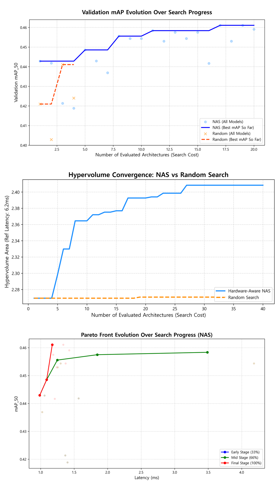

# Kang MyeongJin · 강명진

**Mechanical Engineering undergraduate at Soongsil University**  
**Physical AI · Robot Learning · Multimodal Systems · Robotics**

I work on connecting **perception, learning, planning, and control** in robotic systems. My experience spans real-vehicle autonomy on ERP42, multi-camera product perception, hardware-aware model optimization, learning-based driving in MORAI, and physical robot-arm integration.

On ERP42, I worked on path planning, state machines, sensor integration, and MPC tuning. In learning-based driving, my work extends from collecting and preparing data to model development, training, evaluation, and ROS runtime integration. My current SO-101 work brings motion planning and measured joint feedback together on a physical manipulator.

Alongside technical work, I serve as **President of ACCA**, Soongsil University's robotics/autonomous-systems team, coordinating projects and system integration across perception, localization, planning, control, and learning.

[Email](mailto:markpiano01@gmail.com) · [GitHub](https://github.com/libok03)

## Portfolio overview

| Project | Focus | My work / project scope |
| :--- | :--- | :--- |
| [ERP42 autonomy](https://github.com/libok03/ACCA_2025) | Real-vehicle planning & control | Path planning, state-machine design, sensor integration, MPC tuning |
| [Multi-camera inventory](https://github.com/libok03/RF_Detr_Based_Inventory_management) | Perception & temporal estimation | Temporal event-estimation pipeline and report preparation |
| [Hardware-aware NAS](https://github.com/libok03/HW-NAS-YOLO) | Accuracy–latency optimization | Model training, experimental evaluation, manuscript and poster preparation |
| [Learning-based driving](https://github.com/libok03/VLA_Driving) | Policy learning & runtime integration | Model development, data preparation, training, inference, and ROS integration |
| [SO-101 manipulation](https://github.com/libok03/maker_fair_2026_teleoperation_lerobot) | Simulation & physical robot execution | Ongoing project covering calibration, MoveIt 2 integration, and hardware feedback |

---

## Selected Research & Engineering Projects

### ERP42 real-vehicle robotics
[**ACCA 2025 →**](https://github.com/libok03/ACCA_2025)  
`ROS 2` `Path Planning` `State Machines` `MPC` `Sensor Integration`

  

**My contribution:** path planning, state-machine design, sensor integration, and MPC optimization/tuning on the ERP42 platform.

---

### Multi-camera inventory estimation
[**RF-DETR Based Inventory Management →**](https://github.com/libok03/RF_Detr_Based_Inventory_management)  
`RF-DETR` `YOLO` `OpenCV` `Temporal Filtering`

  

**5 camera views · 60 product classes**  
Converting frame-level detections into class counts, temporally filtered observations, and fused inventory estimates.

**My contribution:** temporal event-estimation pipeline development and final report writing/organization. The public implementation includes detection, count extraction, temporal filtering, and class-wise camera fusion.

---

### Hardware-aware neural architecture search
[**HW-NAS-YOLO →**](https://github.com/libok03/HW-NAS-YOLO)  
`YOLO11n` `NSGA-II` `Ray` `TensorRT FP16`

  
   Accuracy–latency Pareto search and convergence comparison

Searching detector architectures under a joint **accuracy–latency objective**.

- **3 → 15 → 50 epochs:** multi-fidelity evaluation with Successive Halving.
- Block type, depth, and attention-module search with pretrained weight inheritance.
- Random Forest latency prediction with selective TensorRT FP16 hardware measurements.

**My contribution:** model training, experimental evaluation, manuscript writing, and poster preparation.

---

### Learning-based autonomous driving
[**VLA_Driving →**](https://github.com/libok03/VLA_Driving)  
`PyTorch` `TCP` `Imitation Learning` `ROS` `MORAI`

   
  DRIVE / STOP / AVOID predictions · recorded-bag open-loop replay

Adapted **Trajectory-guided Control Prediction (TCP)** to MORAI: front-camera images, vehicle speed, and route conditions produce future waypoints and vehicle control.

- **0.2924 m ADE / 0.5225 m FDE @ 2 s** on the held-out test.
- **100% completion across 4 evaluated laps**, with **0.55 m RMSE** using TCP direct control.
- **11.02 ms mean / 18.05 ms p95** neural inference latency.
- Camera-timestamp dataset alignment, human/teacher data preparation, training, evaluation, and ROS runtime integration.

**My contribution:** learning-model development, data collection and labeling, training and inference pipelines, and runtime integration. Earlier multimodal planner experiments are also retained in the repository.

System context and contribution boundaries

The broader vehicle system combines localization, route conditioning, and an independent Safety Monitor. The repository primarily provides TCP data conversion, training/evaluation, and earlier planner experiments; it does not contain the complete deployable vehicle stack.

MPC and local-route modules were implemented by other team members.  
[Team system repository →](https://github.com/libok03/ACCA2026)

---

### SO-101: planning to physical motion
[**SO-101 Teleoperation & MoveIt 2 →**](https://github.com/libok03/maker_fair_2026_teleoperation_lerobot)  
`ROS 2 Humble` `MoveIt 2` `LeRobot` `Gazebo Harmonic` `ros2_control`

   
  MoveIt 2 plan → physical SO-101 follower → measured joint feedback in RViz

Connecting motion planning to a physical **5-axis arm + gripper**, with feedback from **6 STS3215 servos**.

- Gazebo simulation, URDF/Xacro, MoveIt 2 configuration, and physical follower execution.
- **3 planning pipelines:** OMPL, Pilz, and STOMP.
- Motor setup and calibration tools, trajectory execution, and measured joint-state feedback.
- Ongoing work: teleoperation and demonstration-data workflows; intermittent gripper voltage alarms remain under investigation.

## Research Interests

My interests center on **robot learning and control**, **multimodal robot learning**, and **efficient AI for physical systems**. I am particularly interested in how perception and learned policies connect to planning and execution, and am exploring vision-language-action models and sim-to-real workflows.

## Technical Experience

| Area | Tools & experience |
| :--- | :--- |
| Languages & learning | Python · C++ · PyTorch · TensorRT · CUDA |
| Robotics & control | ROS / ROS 2 · MoveIt 2 · Gazebo · MPC · PID · State Machines · Path Planning |
| Perception & sensing | RF-DETR · YOLO · OpenCV · Camera · LiDAR · IMU · GNSS |
| Systems | Linux · Git · Docker |

## Team & Leadership

**President · ACCA, Soongsil University · 2026**

- Coordinated robotics and autonomous-system projects.
- Managed integration work across perception, localization, planning, control, and learning.
- Organized real-robot and simulation experiments.

  
   ACCA team, Soongsil University

## Other Engineering & Learning Experiments

[UR5e simulation & pick-and-place](https://github.com/libok03/ros2_SimRealRobotControl) ·
[PPO Swing-Up](https://github.com/libok03/PPO_SwingUp) ·
[Atari DQN](https://github.com/libok03/Atari_DQN_Agent) ·
[CartPole RL](https://github.com/libok03/CartPole_RL)

---

## Contact

**Kang MyeongJin · 강명진**  
[markpiano01@gmail.com](mailto:markpiano01@gmail.com) · [@libok03](https://github.com/libok03)
